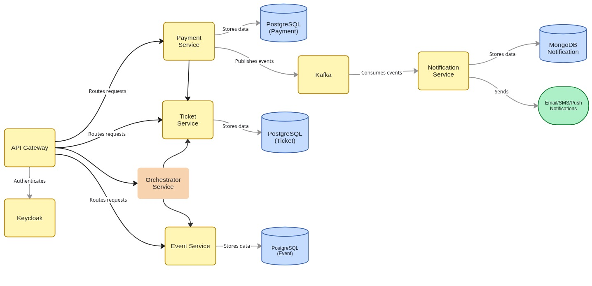

# EventForge — Microservices-Based Event Platform

**EventForge** is a **microservices-based event management system** designed to handle the complete lifecycle of events—from creation and ticketing to payments, monitoring, and validation.

The platform is built with a **distributed architecture**, where each core domain is isolated into its own service, enabling scalability, fault isolation, and independent development.

---

## System Overview

The system supports three primary roles:

- **Organizers** – create and manage events, configure tickets, track sales
- **Attendees** – browse events, purchase tickets, and access event passes
- **Staff** – validate tickets and manage on-ground event operations

Each responsibility is handled by a dedicated microservice communicating through REST APIs and asynchronous messaging.

---

## Microservices Architecture

[ EventForge Full Architecture Design](https://miro.com/app/board/uXjVGVq5l3U=/?moveToWidget=3458764653985736600&cot=14)

The platform is composed of multiple independent services, including:

- [Event Service](https://github.com/mukuldaroch/event-service)
  Manages event creation, publishing, and lifecycle
- [Ticket Service](https://github.com/mukuldaroch/ticket-service)
  Handles ticket types, ticket inventory, and validation
- [Payment Service](https://github.com/mukuldaroch/payment-service)
  Manages payment processing and transaction state
- [Orchestration Service](https://github.com/mukuldaroch/orchestration-service)
  Coordinates multi-step workflows like ticket purchase
- [Notification Service](#)
  Sends emails and system notifications (planned)

Supporting components include **Kafka** for event-driven communication and **Redis** for caching and performance optimization.
Each service owns its own database and can be deployed independently.

Each microservice contains its own:

- README
- Architecture design
- Database schema
- documentation
- Docker configuration

---

---

## Communication Model

- **Synchronous:** REST-based service-to-service communication
- **Asynchronous:** Event-driven workflows using Kafka
- **Caching:** Redis for frequently accessed and transient data

---

## Tech Stack

- **Backend:** Spring Boot (Java)
- **Databases:** PostgreSQL (per service)
- **Messaging:** Apache Kafka
- **Caching:** Redis
- **Containerization:** Docker & Docker Compose
- **Auth:** JWT-based authentication
- **Build Tool:** Gradle

Detailed tech stacks are documented inside each microservice repository.

---

## Future Enhancements

- Distributed tracing and centralized logging
- API Gateway integration
- Rate limiting and circuit breakers
- CI/CD pipelines

---

## Contributing

Contributions are welcome across all services.
Open issues, suggest improvements, or submit pull requests to help evolve the platform.

---

## 👨‍💻 Author

- [@Mukul Daroch](https://github.com/mukuldaroch)
