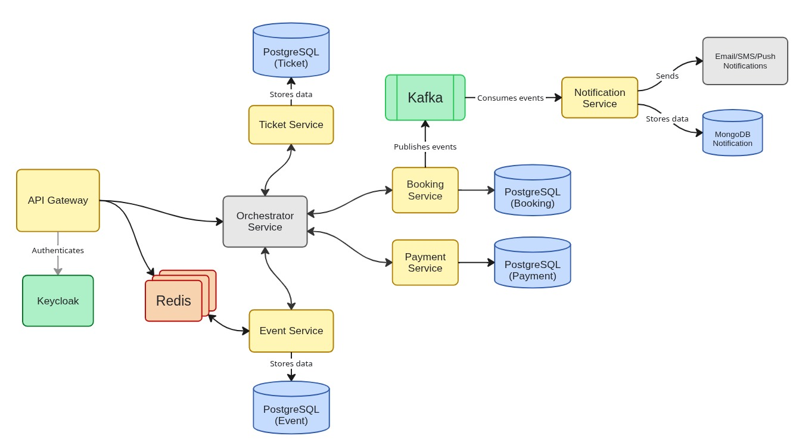

# EventForge — Microservices-Based Event Platform

**EventForge** is a **microservices-based event management system** designed to handle the complete lifecycle of events—from creation and ticketing to payments, monitoring, and validation.

The platform is built with a **distributed architecture**, where each core domain is isolated into its own service, enabling scalability, fault isolation, and independent development.

The system supports three primary roles:

- **Organizers** – create and manage events, configure tickets, track sales
- **Attendees** – browse events, purchase tickets, and access event passes
- **Staff** – validate tickets and manage on-ground event operations

---

## Microservices Architecture



## [ EventForge Full Architecture Design link](https://miro.com/app/board/uXjVGVq5l3U=/?moveToWidget=3458764653985736600&cot=14)

---

## Services in this repository

The platform is composed of multiple independent services, including:

| Service            | What it owns           | What it does                                    |
| ------------------ | ---------------------- | ----------------------------------------------- |
| **Event Service**  | Events                 | Creates, updates, publishes and exposes events  |
| **Ticket Service** | Ticket types & tickets | Manages pricing, inventory, and ticket issuance |
| **Orchestrator**   | Nothing                | Coordinates multi-service operations            |
| **Gateway**        | Nothing                | Coordinates api requests , rate limiting        |

> **Github links for each microservice main branch:**
>
> - [Event Service](https://github.com/mukuldaroch/event-service)
> - [Ticket Service](https://github.com/mukuldaroch/ticket-service)
> - [Orchestration Service](https://github.com/mukuldaroch/orchestration-service)
> - [Gateway Service ](https://github.com/mukuldaroch/gateway-service)

> ⚠️ **Note — Payment & Event Streaming**
>
> The **Payment Service** is a planned future component and is not yet part of the active system.
> In parallel, the platform is being prepared for **event-driven communication** using **Kafka** for:
>
> - Centralized logging
> - Asynchronous workflows (payments, notifications etc.)

---

## 🧩 Tech Stack

- **Backend:** Spring Boot (Java 17+)
- **Build Tool:** Gradle
- **Database:** PostgreSQL
- **Containerization:** Docker & Docker Compose
- **Auth:** Keycloak JWT-based Authentication
- **Frontend (Planned):** React + Tailwind
- **Deployment:** Dockerized microservice setup

---

## 🐳 Running the whole platform

High-level startup order:

1. Docker network
2. PostgreSQL containers
3. Keycloak
4. Event Service
5. Ticket Service
6. Orchestrator

## Each service README explains how to start each microservice.

They all join the same Docker network so they can talk via container names.

---

| Service                  | Container Name         | Internal Port | Exposed Port | Who can access it      |
| ------------------------ | ---------------------- | ------------- | ------------ | ---------------------- |
| **Keycloak**             | `keycloak`             | 8080          | 8080         | Browser , Postman      |
| **event-service**        | `event-service`        | 8083          | 8083         | Orchestrator, Postman  |
| **ticket-service**       | `ticket-service`       | 8084          | 8084         | Orchestrator, Postman  |
| **orchestrator-service** | `orchestrator-service` | 8085          | 8085         | Frontend / API clients |
| **event-database**       | `event-database`       | 5432          | 5432         | pgcli , postgres       |
| **ticket-database**      | `ticket-database`      | 5434          | 5434         | pgcli , postgres       |

---

## Why Orchestration Exists

Creating an event with tickets is **one business action**, but technically it requires:

1. Creating the Event
2. Creating Ticket Types linked to that Event

It owns:

- The public API
- The call order
- Failure handling
- JWT forwarding

---

## 🔐 Security Model

Users authenticate once and receive a **JWT**.

That JWT is then:

- Sent to Orchestrator
- Forwarded to Event Service
- Forwarded to Ticket Service

Each service validates the token independently.

---

## API Endpoints

events

| Method     | Endpoint             | Description            |
| ---------- | -------------------- | ---------------------- |
| **POST**   | `/events`            | Create a new event     |
| **GET**    | `/events/{event_id}` | Retrieve event details |
| **PATCH**  | `/events/{event_id}` | Update event details   |
| **DELETE** | `/events/{event_id}` | Delete an event        |

Public Events

| Method  | Endpoint                       | Description                 |
| ------- | ------------------------------ | --------------------------- |
| **GET** | `/events/published`            | List all published events   |
| **GET** | `/events/published/{event_id}` | Get published event details |

orchestrator-service

| Method | Endpoint                | What it does                                        | Who actually handles it                |
| ------ | ----------------------- | --------------------------------------------------- | -------------------------------------- |
| POST   | `/api/events`           | Creates an event **and** its ticket types in one go | Orchestrator → Event + Ticket services |
| GET    | `/api/events/{eventId}` | Fetches event details                               | Event Service (via Orchestrator)       |
| PATCH  | `/api/events/{eventId}` | Updates event metadata                              | Event Service (via Orchestrator)       |
| DELETE | `/api/events/{eventId}` | Deletes the event and all related ticket types      | Orchestrator → Event + Ticket services |

Ticket-Types

| Method     | Endpoint                                    | Description                        |
| ---------- | ------------------------------------------- | ---------------------------------- |
| **GET**    | `/ticket-types?{event-id}`                  | List all ticket types for an event |
| **GET**    | `/ticket-types/{ticket_type_id}`            | Retrieve ticket type details       |
| **PATCH**  | `/ticket-types/{ticket-type-id}?{event-id}` | Update ticket type                 |
| **DELETE** | `/ticket-types/{ticket_type_id}`            | Delete ticket type                 |

Tickets

| Method     | Endpoint              | Description                  |
| ---------- | --------------------- | ---------------------------- |
| **GET**    | `/ticket`             | List all tickets for a event |
| **GET**    | `/ticket/{ticket_id}` | Retrieve details of a ticket |
| **PATCH**  | `/ticket{ticket_id}`  | Update ticket info           |
| **DELETE** | `/ticket{ticket_id}`  | Delete a ticket of a event   |

---

## 📦 Repository Layout

This repository uses a **multi-repo microservice model** (each service can be cloned and deployed independently), but architecturally it behaves as one system.

```
eventforge/
├── event-service/
├── ticket-service/
├── orchestrator-service/
├── gateway-service/
└── docs/
    └── architecture diagrams
```

Each service has its own:

- Dockerfile
- Database
- README
- Deployment model

---

## Engineering Principles Behind This

EventForge uses:

- OAuth2 Resource Server (JWT)
- Real Keycloak realms
- Isolated databases
- Docker networking
- Service-to-service authentication
- Orchestration

---

## Future Plans

Planned services:

- Payment Service
- Notification Service
- Search & Discovery

The architecture already supports them.

---

## 👨‍💻 Author

- [@Mukul Daroch](https://github.com/mukuldaroch)
